# Kibana
Here we have some examples to learn how to use kibana

## Table of Contents
* [Kibana with docker](#kibana-with-docker)
* [Kibana wellcome](#kibana-wellcome)
* [Kibana Analytics - Discover](#kibana-analytics---discover)
* [Kibana Analytics - Visualize Library](#kibana-analytics---visualize-library)
* [Kibana Analytics - Dashboard](#kibana-analytics---dashboard)
* [Kibana Analytics - Canvas](#kibana-analytics---canvas)
* [Kibana Analytics - Maps](#kibana-analytics---maps)

## Kibana with docker
In order to use Kibana with docker we are going to use docker compose to start a elasticsearch container and a kibana container.

docker-compose.yml file:
```sh
services:
  elasticsearch:
    image: elasticsearch:8.3.3
    container_name: my_elasticsearch_8
    environment:
      discovery.type: single-node
      ES_JAVA_OPTS: "-Xms512m -Xmx512m"
    ports:
      - "9200:9200"
      - "9300:9300"
    healthcheck:
      test: ["CMD-SHELL", "curl --silent --fail localhost:9200/_cluster/health || exit 1"]
      interval: 10s
      timeout: 10s
      retries: 3
    networks:
      - elastic
  kibana:
    image: kibana:8.3.3
    container_name: my_kibana_8
    ports:
      - "5601:5601"
    depends_on:
      - elasticsearch
    networks:
      - elastic
networks:
  elastic:
    driver: bridge
```

To launch the docker compose we can use this command:
```sh
docker compose up
```

Output:
```sh
[+] Running 2/1
 ⠿ Container my_elasticsearch_8  Created                                                                                                                           0.1s
 ⠿ Container my_kibana_8         Created                                                                                                                           0.1s
Attaching to my_elasticsearch_8, my_kibana_8
my_elasticsearch_8  | {"@timestamp":"2022-08-18T21:46:23.967Z", "log.level": "INFO", "message":"version[8.3.3], pid[72], build[docker/801fed82df74dbe537f89b71b098ccaff88d2c56/2022-07-23T19:30:09.227964828Z], OS[Linux/5.10.47-linuxkit/amd64], JVM[Oracle Corporation/OpenJDK 64-Bit Server VM/18.0.2/18.0.2+9-61]", "ecs.version": "1.2.0","service.name":"ES_ECS","event.dataset":"elasticsearch.server","process.thread.name":"main","log.logger":"org.elasticsearch.node.Node","elasticsearch.node.name":"d77d916e58de","elasticsearch.cluster.name":"docker-cluster"}
my_elasticsearch_8  | {"@timestamp":"2022-08-18T21:46:23.979Z", "log.level": "INFO", "message":"JVM home [/usr/share/elasticsearch/jdk], using bundled JDK [true]", "ecs.version": "1.2.0","service.name":"ES_ECS","event.dataset":"elasticsearch.server","process.thread.name":"main","log.logger":"org.elasticsearch.node.Node","elasticsearch.node.name":"d77d916e58de","elasticsearch.cluster.name":"docker-cluster"}
...
```

Now we are able to go to "http://localhost:5601/" in order to use kibana. In this section we are going to continue with the configuration. We are going to see a page to insert our enrollment token:

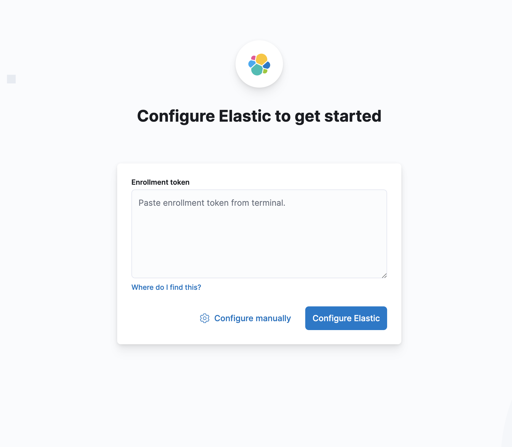

How to get the enrollment token? We have to go to my_elasticsearch_8 container and ask for it
```sh
docker exec -it my_elasticsearch_8 /bin/bash
```

And after execute this command inside my_elasticsearch_8 container
```sh
bin/elasticsearch-create-enrollment-token --scope kibana
```

Output:
```sh
WARNING: Owner of file [/usr/share/elasticsearch/config/users] used to be [root], but now is [elasticsearch]
WARNING: Owner of file [/usr/share/elasticsearch/config/users_roles] used to be [root], but now is [elasticsearch]
eyJ2ZXIiOiI4LjMuMyIsImFkciI6WyIxNzIuMjEuMC4yOjkyMDAiXSwiZmdyIjoiZjZhNWRmZjQ2ZjZkZjAyZjZkNjdhOGY4YTc4ZDc5ZjY0ZTgwYzQzZGM3Yjc0MTAzMjUwZTNlN2ZlMjdhNThkMiIsImtleSI6IkNBSDRzb0lCbDktUU9mUHFDbkRJOmJTdndPRlZNVE5XUHVtOXhZcEtjZ1EifQ==
```

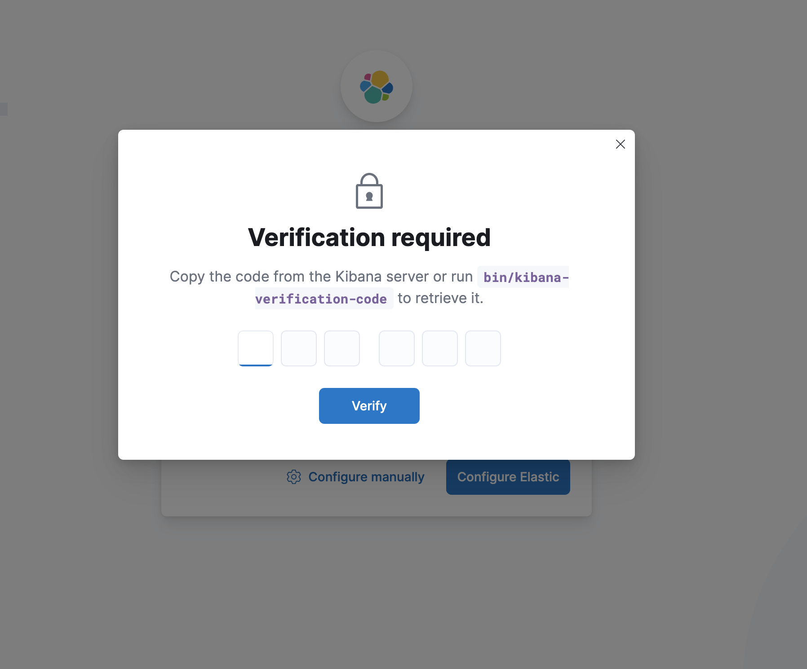

After introducing the token in the input, we will see a modal with the title verification required. In this step we have to enter in my_kibana_8 container and execute:
```sh
docker exec -it my_kibana_8 /bin/bash
bin/kibana-verification-code
```

Output:
```sh
Your verification code is:  XXX XXX
```

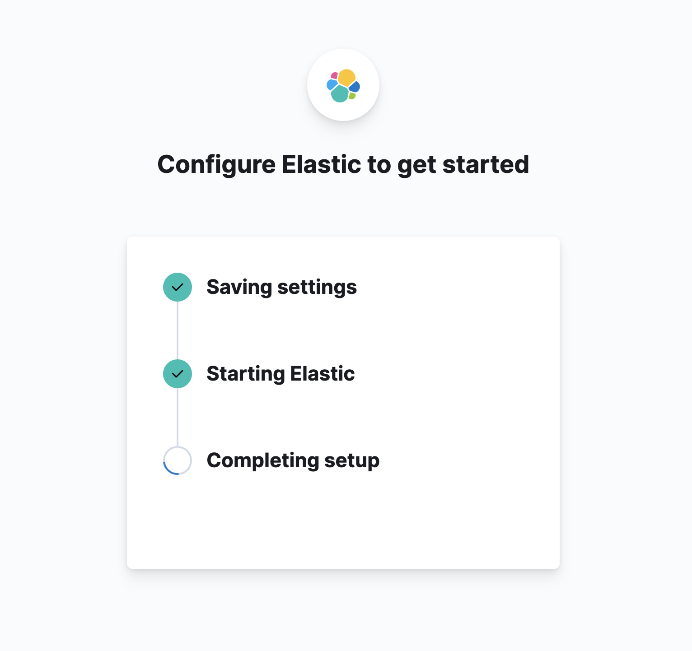
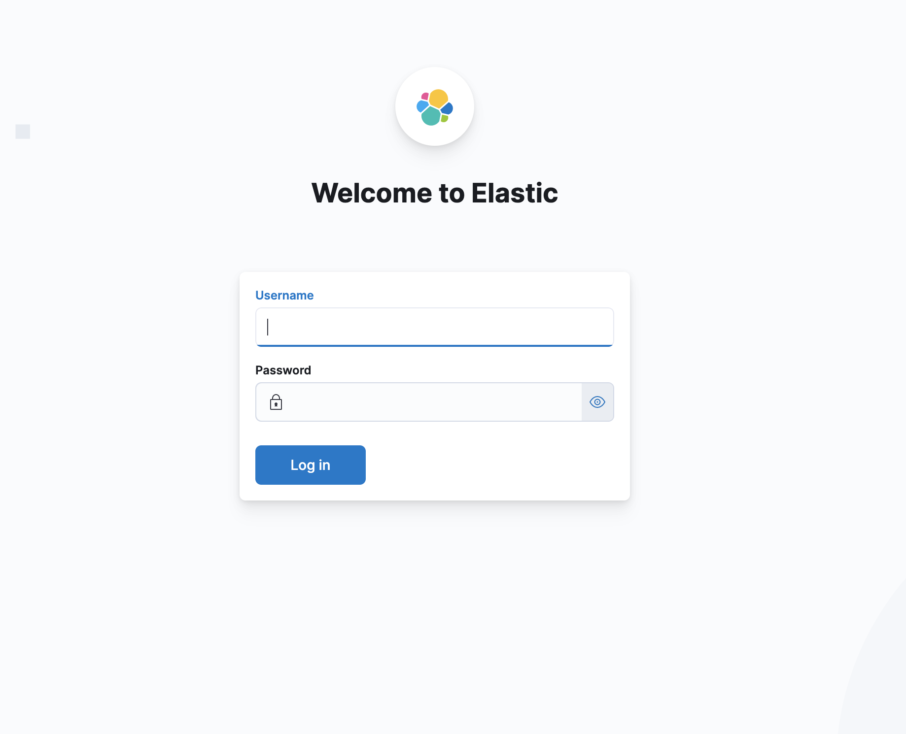

The last step is configure all the passwords. In order to do it, we have to enter in my_elasticsearch_8 container and execute:
```sh
docker exec -it my_elasticsearch_8 /bin/bash
bin/elasticsearch-setup-passwords auto 
```

Output:
```sh
******************************************************************************
Note: The 'elasticsearch-setup-passwords' tool has been deprecated. This       command will be removed in a future release.
******************************************************************************

Initiating the setup of passwords for reserved users elastic,apm_system,kibana,kibana_system,logstash_system,beats_system,remote_monitoring_user.
The passwords will be randomly generated and printed to the console.
Please confirm that you would like to continue [y/N]y


Changed password for user apm_system
PASSWORD apm_system = VS8aZj4SDlP2SPnmnoAw

Changed password for user kibana_system
PASSWORD kibana_system = sJaSikzbNlaZvAIqXQBZ

Changed password for user kibana
PASSWORD kibana = sJaSikzbNlaZvAIqXQBZ

Changed password for user logstash_system
PASSWORD logstash_system = IfQYF2RtKIoXoWALPRey

Changed password for user beats_system
PASSWORD beats_system = kXBoyCNXtTl3aODUXTHN

Changed password for user remote_monitoring_user
PASSWORD remote_monitoring_user = D8clsLQsJBpJDnbYkVKt

Changed password for user elastic
PASSWORD elastic = YvwWrKTsa2rzGEQU8BE3
```

Finally we are able to login in kibana "http://localhost:5601/" with the user elastic and the password generated.


## Kibana wellcome
In the next image we can see the wellcome or home of kibana.

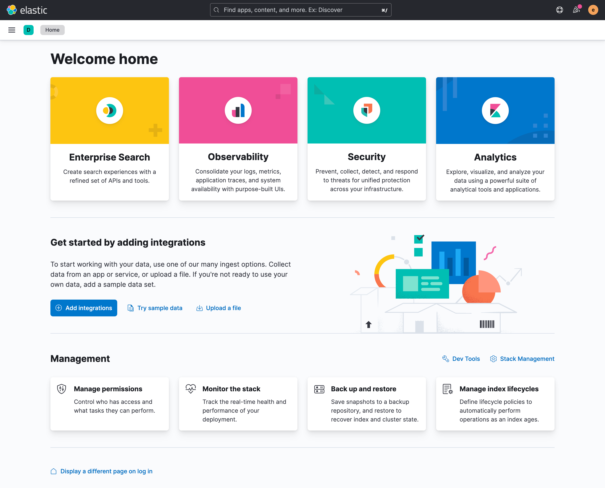

Now we are going to create some indexes with the resources that we have and also adding some sampling data that kibana gives to us in order to start playing with.

### Kibana csv integrations
We are going to create 5 indexes with the 5 csv of starwars that we have in the resources folder. We have to click on "Upload a file". 

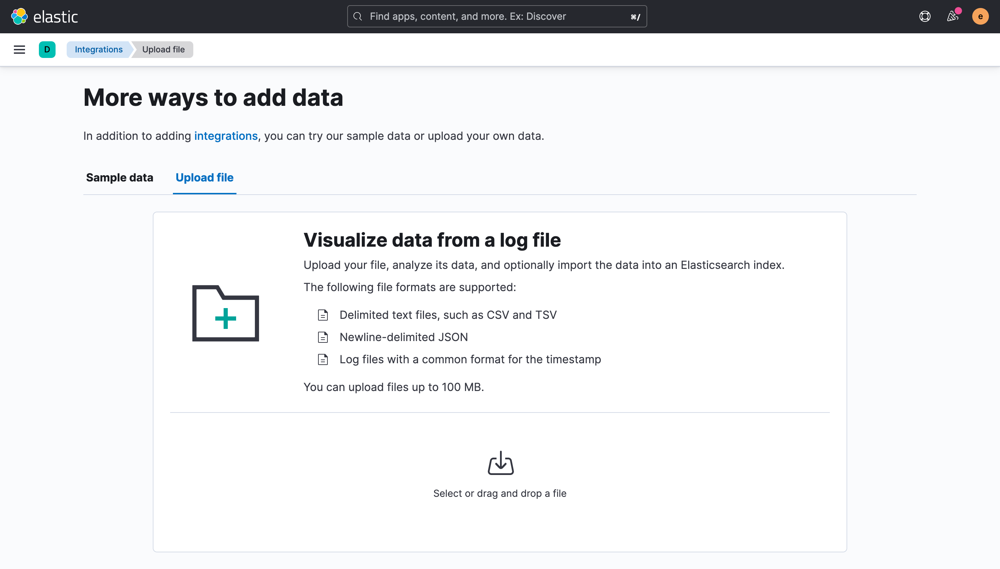

First of all we are going to upload "resources/starwars-characters.csv". Once we have selected the file, kibana gives some information about the csv.

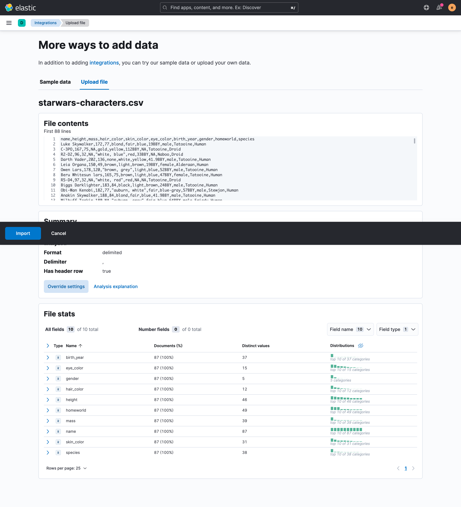

Then we have to click on "import" button. In this step kibana is going to ask for the name of the index. We can name it "starwars-characters".

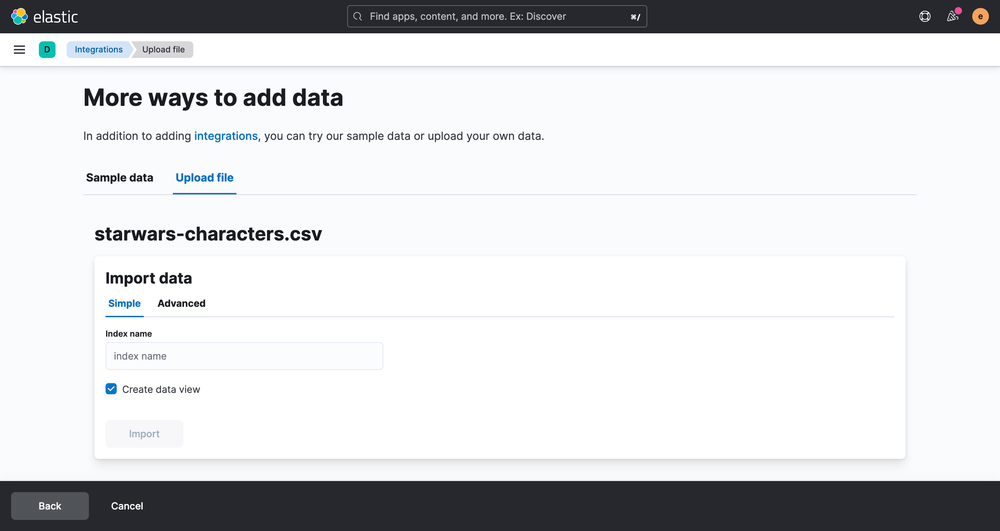

We can repeat the import of csv with all the resources. After the creation of all the index and the import of the documents we can go to "http://localhost:5601/app/discover#/" and select the index "starwars-characters" to start searching documents with kibana.

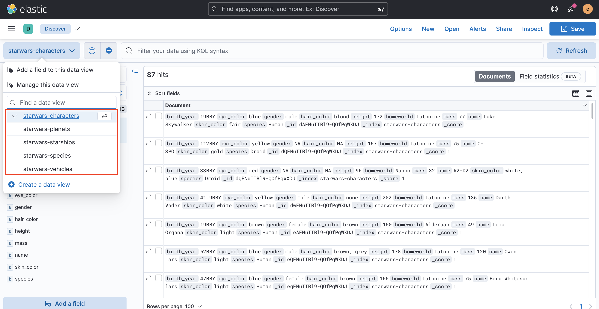

Before starting using the discovery section we are going to add some sample data.

### Kibana sample data integrations

We can go to the url "http://localhost:5601/app/home#/tutorial_directory/sampleData" in order to add one of the three sample data that gives to us kibana. We will choose the "Sample flight data" then we have to click on "Add data".

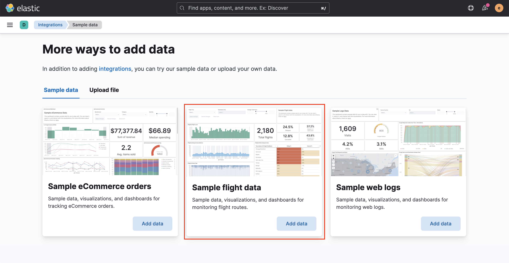

Now we are able to go and discover data at ""http://localhost:5601/app/discover#/""


## Kibana Analytics - Discover
In the Discovery part we have some uses cases:
* [Select data view](#select-data-view)
* [Filter data with a filter](#filter-data-with-a-filter)
* [Filter data using KQL syntax](#filter-data-using-kql-syntax)
* [Select fields](#select-fields)

### Select data view
Selecting the data view we can start doing the discovery, sometimes our data views are the same as our indexes. In our case we have 5 data views created (starwars) and another view of flights. We can see that in the next image.


### Filter data with a filter
A good way to start discovering data is using the filter that is given by kibana. We are going to use it selecting the field "name" using the operator "is" and giving a value "Anakin Skywalker".

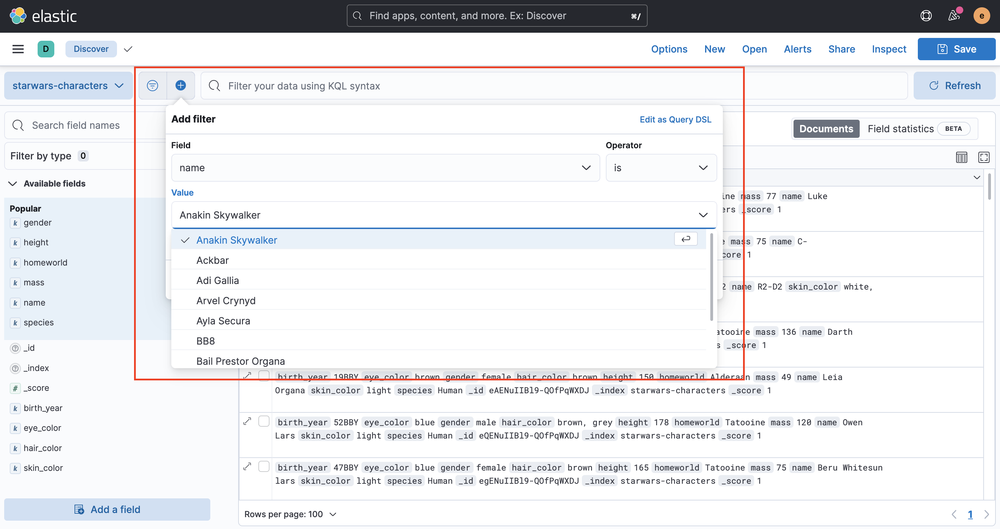

### Filter data using KQL syntax
Another way to discover data is using KQL syntax. We are going to do the same example. We write the next query 'name : "Anakin Skywalker"' having the same result.

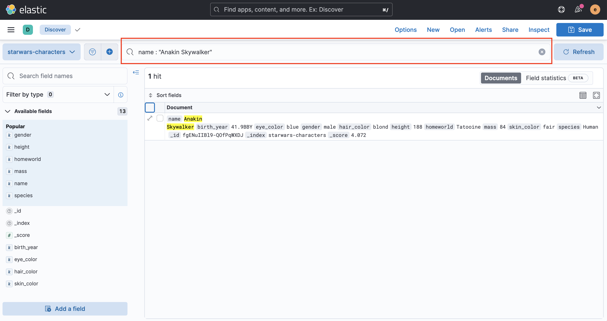

### Select fields
In this section we are able to select the fields that we want to show the data in the right part.

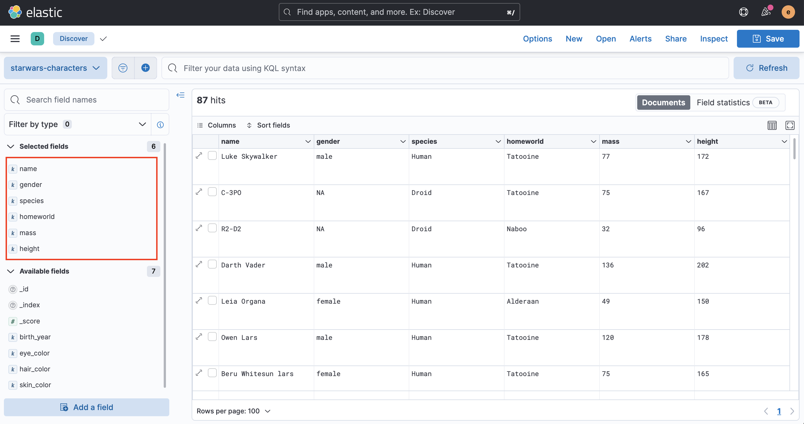


## Kibana Analytics - Visualize Library
In the Visualize Library section we are able to:
* [List visualizations](#list-visualizations)
* [Create visualization](#create-visualization)
* [Edit visualization](#edit-visualization)

### List visualizations
In the section Kibana Analytics - Visualize Library we are able to see all the graphs saved in a library. We can use all of them in our dashboards and in our canvas. In the next image we will see a list of visualizations saved until now.

In the image we are going to see five visualizations of "Starwars". All of them are from "Starwars" indexes. Also we will see other visualizations of flights. They come from the data example of flights.

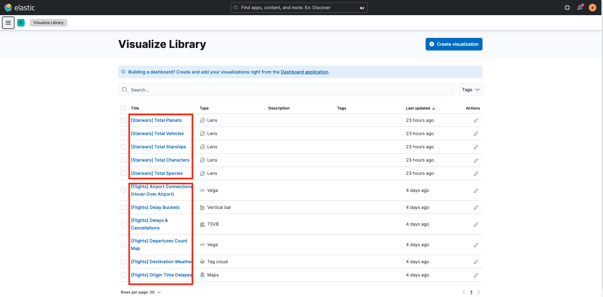

### Create visualization
In the creation part we are going to see an gif image showing/explaining the steps to create a new visualization:
1. Click on create button
2. Select Lens (tool of kibana to help creating visualizations)
3. Select the index
4. Select the fields for the visualization
5. Save visualization as "[Starwars] Characters by Gender"

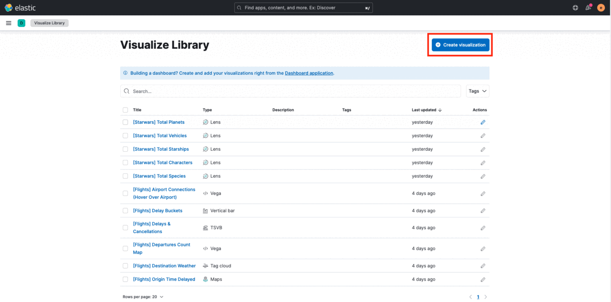

### Edit visualization
In the edition part we are going to edit the visualization "[Starwars] Characters by Gender" and modify the graph with bars into a donut chart.
1. Edit "[Starwars] Characters by Gender"
2. Select Donut chart type
3. Save the modifications

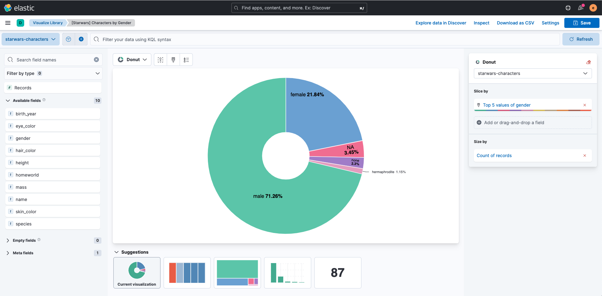

## Kibana Analytics - Dashboard
In the Dashboard section we are able to:
* [List dashboards](#list-dashboards)
* [Create dashboard](#create-dashboard)
* [Edit dashboard](#edit-dashboard)

### List dashboards
In the section Kibana Analytics - Dashboard, we are able to see all the dashboards created. This dasboards are a group of visualizations.

### Create dashboard
### Edit dashboard

## Kibana Analytics - Canvas
In the Canvas section we are able to:
* [List canvas](#list-canvas)
* [Create canvas](#create-canvas)
* [Edit canvas](#edit-canvas)

### List canvas
### Create canvas
### Edit canvas


## Kibana Analytics - Maps
In the Maps section we are able to:
* [List maps](#list-maps)
* [Create map](#create-map)
* [Edit map](#edit-map)

### List maps
### Create map
### Edit map

